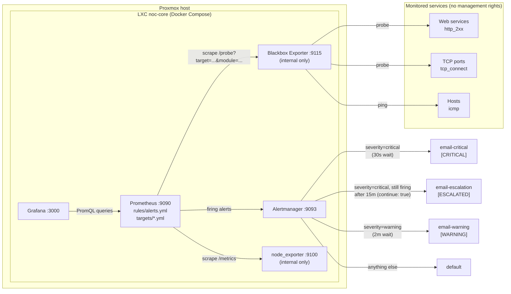

# noc-core monitoring stack

A lightweight Network Operations Center (NOC) built for a student project. It watches services from the outside, using HTTP, TCP and ICMP probes, so it works for services we have no management rights on. It also collects machine metrics with node_exporter where we are allowed to install it. Alerts go out by email, split by severity, with grouping, inhibition, maintenance silences and escalation.

The stack runs as Docker Compose on an LXC container called **noc-core** on a Proxmox host.

## Architecture



## Features

### Working

Tested end to end:

- **Black-box probes** (HTTP 2xx, TCP connect, ICMP) through Blackbox Exporter. Targets live in `prometheus/targets/*.yml` and are picked up without a restart (file-based service discovery).
- **Alert `ServiceDown`** (critical): a probe has been failing for 2 minutes.
- **Alert `ServiceSlow`** (warning): an HTTP probe succeeds but takes more than 1 s, for 5 minutes.
- **Alert `DiskSpaceLow`** (warning): less than 15 % free disk space, for 10 minutes.
- **Alert `MonitoringCheckFailed`** (critical): Prometheus cannot scrape node_exporter or Blackbox Exporter, which means the monitoring itself is blind.
- **Email routing by severity**: critical and warning go to separate receivers with their own subject and timing.
- **Grouping**: alerts with the same `alertname` and `host` are bundled into one email.
- **Inhibition**: a failing ICMP probe on a host suppresses the `ServiceDown` alerts of HTTP probes on the same host.
- **Maintenance silences** through the Alertmanager UI or `amtool`.
- **Escalation**: a critical alert that is still firing after 15 minutes also goes to an escalation receiver, and it gets a resolved email too.
- **Host metrics** for noc-core itself through node_exporter.
- **Grafana** with Prometheus as a data source (added by hand).

Written but not tested:

- **Alert `DiskWillFillSoon`** (warning): a linear forecast says the disk is full within 24 hours. It needs hours of real disk growth to test, so it has not fired yet.

### Planned (not built yet)

- Loki for logs
- Public or internal status page
- Proxmox API exporter (per-LXC/VM metrics and quotas)
- smartctl_exporter (disk health)
- Grafana dashboards as code (provisioning)
- Backup and restore of Prometheus, Grafana and Alertmanager data
- Automated deployment with Ansible/Terraform

## Quick start

Full explanation, prerequisites and checks are in [docs/setup.md](docs/setup.md).

```bash
git clone https://github.com/Jschacht06/monitoring.git /opt/monitoring
cd /opt/monitoring
cp compose-template.yaml compose.yaml
nano compose.yaml                      # replace <your-host> with the noc-core IP
cp alertmanager/template.yml alertmanager/alertmanager.yml
nano alertmanager/alertmanager.yml     # fill in SMTP settings and recipients
docker compose up -d
docker compose ps                      # all five services should be "Up"
```

Then open Prometheus on `http://<noc-core-ip>:9090`, Grafana on `http://<noc-core-ip>:3000` and Alertmanager on `http://<noc-core-ip>:9093`.

## Repo layout

```text
.
├── README.md                     # This file
├── compose-template.yaml         # Docker Compose stack; copy to compose.yaml (ignored by Git) and set your host IP
├── .gitignore                    # Keeps compose.yaml, alertmanager.yml (secrets) and real target files out of Git
├── alertmanager/
│   └── template.yml              # Alertmanager config template; copy to alertmanager.yml and add SMTP + recipients
├── blackbox/
│   └── blackbox.yml              # Blackbox Exporter probe modules: http_2xx, tcp_connect, icmp
├── prometheus/
│   ├── prometheus.yml            # Prometheus config: scrape jobs, rule files, Alertmanager address
│   ├── rules/
│   │   └── alerts.yml            # All alert rules (availability, capacity, monitoring-health)
│   └── targets/
│       └── template.yml          # Template for probe target files; real files (*.yml) are ignored by Git
└── docs/
    ├── setup.md                          # Setup from scratch on a Proxmox LXC
    ├── adding-targets.md                 # How to add services and hosts to monitor
    ├── configuration-reference.md        # Every config file explained
    ├── how-to-guides.md                  # Recipes: thresholds, routing, inhibition, silences, escalation, ...
    └── operations-and-troubleshooting.md # Daily commands, applying changes, known problems, security
```

## Documentation

| Document | Read it when you want to... |
|---|---|
| [docs/setup.md](docs/setup.md) | Install the stack from scratch |
| [docs/adding-targets.md](docs/adding-targets.md) | Monitor a new service or host |
| [docs/configuration-reference.md](docs/configuration-reference.md) | Understand what each setting does |
| [docs/how-to-guides.md](docs/how-to-guides.md) | Change thresholds, routing, inhibition, silences, escalation, receivers or secrets |
| [docs/operations-and-troubleshooting.md](docs/operations-and-troubleshooting.md) | Run the stack day to day and fix common problems |
